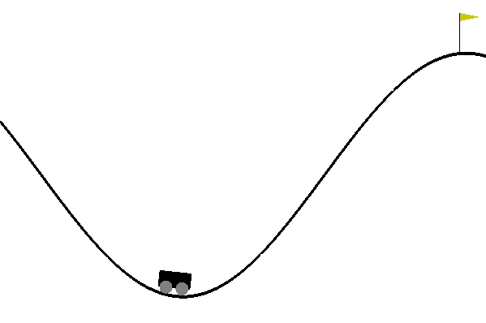
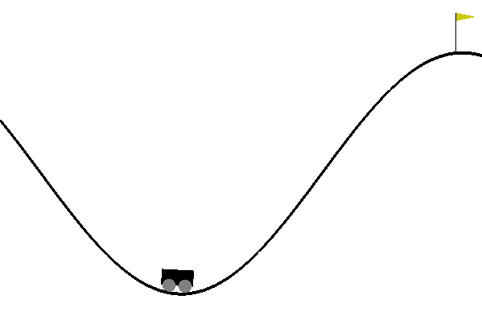

# MountainCar-v0 Deep Q-Learning
MountainCar-v0 is an environment presented by OpenAI Gym. In this repository we have used Deep Q Learning algorithm [1] for building an agent to solve this environment.

### Commands to run
#### To train the model
python train_model.py

#### To test the model
python test_model.py 'path_of_saved_model_weights' (without quotes)

To test agent with our trained weights: python test_model.py saved_model/-134.0_agent_.h5

##### The greater the value of the episodic reward achieved, the better is the model.

### Results

#### Output of agent taking random actions

#### Output of our agent at Episode: 550 with score -134.0

### References
[1] Playing Atari with Deep Reinforcement Learning
    Authors: Volodymyr Mnih, Koray Kavukcuoglu, David Silver, Alex Graves, Ioannis Antonoglou, Daan Wierstra, Martin Riedmiller       
    Link: https://www.cs.toronto.edu/~vmnih/docs/dqn.pdf

